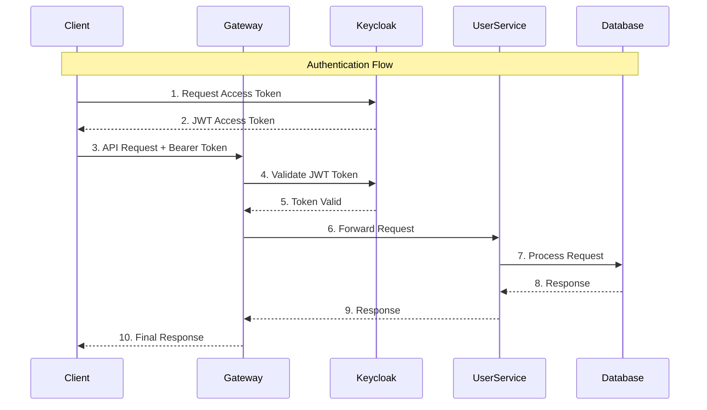

# Fitness Microservice Application

A comprehensive fitness tracking microservice application built with Spring Boot and Spring Cloud, featuring user management, activity tracking, AI-powered recommendations, and OAuth2/Keycloak authentication.

## 🏗️ Architecture Overview

```
┌─────────────────┐    ┌─────────────────┐    ┌─────────────────┐    ┌─────────────────┐
│   Keycloak      │    │   API Gateway   │    │   Config Server │    │  Eureka Server  │
│   Port: 8181    │    │   Port: 8085    │    │   Port: 8888    │    │   Port: 8761    │
│   (OAuth2/JWT)  │    │  (OAuth2 Secured)│    │ (Configuration) │    │(Service Disco.) │
└─────────────────┘    └─────────────────┘    └─────────────────┘    └─────────────────┘
         │                       │                       │                       │
         └───────────────────────┼───────────────────────┼───────────────────────┘
                                 │                       │
    ┌────────────────────────────┼───────────────────────┼────────────────────────────┐
    │                            │                       │                            │
┌─────────────┐      ┌─────────────┐      ┌─────────────┐      ┌─────────────┐
│User Service │      │Activity Svc │      │ AI Service  │      │   More...   │
│Port: 8084   │      │Port: 8082   │      │Port: 8083   │      │             │
└─────────────┘      └─────────────┘      └─────────────┘      └─────────────┘
    │                    │                    │
┌─────────────┐      ┌─────────────┐      ┌─────────────┐
│ PostgreSQL  │      │   Kafka     │      │   MongoDB   │
│Port: 5432   │      │Port: 9092   │      │Port: 27017  │
└─────────────┘      └─────────────┘      └─────────────┘
```

## � Authentication Flow



## �🚀 Services

### Core Services

1. **Keycloak Authentication Server** (Port: 8181)
   - OAuth2/OpenID Connect provider
   - JWT token generation and validation
   - User authentication and authorization
   - Realm: `fitness-app`

2. **API Gateway** (Port: 8085)
   - Entry point for all client requests
   - OAuth2 Resource Server with JWT validation
   - Routes requests to appropriate microservices
   - Load balancing with Eureka service discovery
   - Public endpoints: `/api/users/register`, `/api/users/health`

3. **User Service** (Port: 8084)
   - User registration and profile management
   - PostgreSQL database integration
   - RESTful APIs for user operations
   - Eureka service registration

4. **Activity Service** (Port: 8082)
   - Activity tracking and management
   - Integration with User Service for validation
   - Kafka messaging for activity events
   - MongoDB for activity data storage

5. **AI Service** (Port: 8083)
   - AI-powered fitness recommendations
   - Google Gemini API integration
   - MongoDB for recommendation data
   - Kafka consumer for activity data

### Infrastructure Services

6. **Eureka Discovery Server** (Port: 8761)
   - Service registration and discovery
   - Health monitoring
   - Load balancing support

7. **Config Server** (Port: 8888)
   - Centralized configuration management
   - Environment-specific configurations
   - Native file-based configuration storage

## 🔧 Configuration

### Port Configuration
| Service | Port | Description |
|---------|------|-------------|
| Keycloak | 8181 | OAuth2/OpenID Connect Server |
| API Gateway | 8085 | Main entry point (OAuth2 secured) |
| Config Server | 8888 | Configuration management |
| Eureka Server | 8761 | Service discovery |
| User Service | 8084 | User management |
| Activity Service | 8082 | Activity tracking |
| AI Service | 8083 | AI recommendations |
| PostgreSQL | 5432 | User data database |
| MongoDB | 27017 | Activity & AI data |
| Kafka | 9092 | Message broker |

### Security Configuration

#### OAuth2/JWT Configuration (Gateway)
```yaml
spring:
  security:
    oauth2:
      resourceserver:
        jwt:
          issuer-uri: http://localhost:8181/realms/fitness-app
          jwk-set-uri: http://localhost:8181/realms/fitness-app/protocol/openid-connect/certs
```

#### Public Endpoints (No Authentication Required)
- `POST /api/users/register` - User registration
- `GET /api/users/health` - Health check
- `GET /actuator/**` - Actuator endpoints

#### Protected Endpoints (JWT Token Required)
- `GET /api/users/{userId}` - Get user profile
- `GET /api/users/{userId}/validate` - Validate user
- `POST /api/activities/**` - Activity operations
- `GET /api/recommendations/**` - AI recommendations

## 🛠️ Prerequisites

### Required Software
- **Java 21** - OpenJDK or Oracle JDK
- **Maven 3.9+** - Build tool
- **Docker & Docker Compose** - For databases and Keycloak
- **Git** - Version control

### Database Setup
```bash
# PostgreSQL for User Service
docker run --name postgres-fitness \
  -e POSTGRES_DB=fitness-micro-user \
  -e POSTGRES_USER=postgres \
  -e POSTGRES_PASSWORD=15aGG15@ \
  -p 5432:5432 -d postgres:15

# MongoDB for Activity & AI Services
docker run --name mongo-fitness \
  -p 27017:27017 -d mongo:7

# Kafka for messaging
docker run --name kafka-fitness \
  -p 9092:9092 \
  -e KAFKA_ZOOKEEPER_CONNECT=localhost:2181 \
  -e KAFKA_ADVERTISED_LISTENERS=PLAINTEXT://localhost:9092 \
  -d confluentinc/cp-kafka:latest
```

### Keycloak Setup
```bash
# Run Keycloak
docker run --name keycloak-fitness \
  -p 8181:8080 \
  -e KEYCLOAK_ADMIN=admin \
  -e KEYCLOAK_ADMIN_PASSWORD=admin \
  quay.io/keycloak/keycloak:latest start-dev
```

## 🚀 Quick Start

### 1. Clone Repository
```bash
git clone https://github.com/Ankitrj3/fitness-microservice.git
cd fitness-microservice
```

### 2. Start Infrastructure Services
```bash
# Start databases and Keycloak (see Prerequisites section)
# Or use Docker Compose if available
docker-compose up -d
```

### 3. Configure Keycloak

#### Step 1: Access Admin Console
- URL: http://localhost:8181/admin
- Username: `admin`
- Password: `admin`

#### Step 2: Create Realm
1. Click **Add realm**
2. Name: `fitness-app`
3. Click **Create**

#### Step 3: Create Client
1. Go to **Clients** → **Create**
2. **Client ID**: `fitness-client`
3. **Client Protocol**: `openid-connect`
4. **Root URL**: `http://localhost:8085`
5. Click **Save**

#### Step 4: Configure Client
1. **Access Type**: `confidential`
2. **Service Accounts Enabled**: `ON`
3. **Authorization Enabled**: `OFF`
4. **Standard Flow Enabled**: `ON`
5. **Direct Access Grants Enabled**: `ON`
6. **Valid Redirect URIs**: `http://localhost:8085/*`
7. Click **Save**

#### Step 5: Get Client Secret
1. Go to **Credentials** tab
2. Copy the **Secret** value
3. Save this for API testing

### 4. Start Microservices (in order)
```bash
# Terminal 1 - Config Server
cd configserver
./mvnw spring-boot:run

# Terminal 2 - Eureka Server
cd eureka
./mvnw spring-boot:run

# Terminal 3 - API Gateway
cd gateway
./mvnw spring-boot:run

# Terminal 4 - User Service
cd userservice
./mvnw spring-boot:run

# Terminal 5 - Activity Service
cd activityservice
./mvnw spring-boot:run

# Terminal 6 - AI Service
cd aiservice
./mvnw spring-boot:run
```

### 5. Verify Services
```bash
# Check Eureka Dashboard
curl http://localhost:8761

# Check service health
curl http://localhost:8085/api/users/health
```

## 📱 API Testing with Postman

### Setting Up Authentication

#### Step 1: Get Access Token
```http
POST http://localhost:8181/realms/fitness-app/protocol/openid-connect/token
Content-Type: application/x-www-form-urlencoded

grant_type=client_credentials
&client_id=fitness-client
&client_secret=YOUR_CLIENT_SECRET_FROM_KEYCLOAK
```

**Response:**
```json
{
  "access_token": "eyJhbGciOiJSUzI1NiIsInR5cCI6IkpXVCJ9...",
  "expires_in": 3600,
  "token_type": "Bearer",
  "scope": "profile email"
}
```

#### Step 2: Configure Postman Authorization

**Method 1: Manual Bearer Token**
1. In Postman, go to **Authorization** tab
2. Select **Type**: `Bearer Token`
3. Paste the `access_token` value

**Method 2: Automated OAuth2 (Recommended)**
1. **Type**: `OAuth 2.0`
2. **Grant Type**: `Client Credentials`
3. **Access Token URL**: `http://localhost:8181/realms/fitness-app/protocol/openid-connect/token`
4. **Client ID**: `fitness-client`
5. **Client Secret**: `YOUR_CLIENT_SECRET`
6. **Scope**: `openid profile email`
7. Click **Get New Access Token**

### API Endpoints

#### Public Endpoints (No Authentication)

**User Registration**
```http
POST http://localhost:8085/api/users/register
Content-Type: application/json

{
  "firstName": "John",
  "lastName": "Doe",
  "email": "john.doe@example.com",
  "password": "password123"
}
```

**Health Check**
```http
GET http://localhost:8085/api/users/health
```

#### Protected Endpoints (Requires JWT Token)

**Get User Profile**
```http
GET http://localhost:8085/api/users/{userId}
Authorization: Bearer YOUR_ACCESS_TOKEN
```

**Validate User**
```http
GET http://localhost:8085/api/users/{userId}/validate
Authorization: Bearer YOUR_ACCESS_TOKEN
```

**Create Activity**
```http
POST http://localhost:8085/api/activities
Authorization: Bearer YOUR_ACCESS_TOKEN
Content-Type: application/json

{
  "userId": "user-id",
  "activityType": "RUNNING",
  "duration": 30,
  "distance": 5.0,
  "calories": 300
}
```

**Get Recommendations**
```http
GET http://localhost:8085/api/recommendations/{userId}
Authorization: Bearer YOUR_ACCESS_TOKEN
```

### Testing Flow

#### 1. Test Public Endpoints
- Register a new user
- Check health endpoints
- Verify no authentication required

#### 2. Test Authentication
- Get access token from Keycloak
- Verify token in JWT.io
- Test token expiration

#### 3. Test Protected Endpoints
- Use valid token → Success (200)
- Use invalid token → Unauthorized (401)
- Use expired token → Unauthorized (401)
- No token → Unauthorized (401)

#### 4. Test Service Integration
- Create user → Get user profile
- Create activity → Get recommendations
- Verify service-to-service communication

## 🔍 Troubleshooting

### Common Issues

**1. Port Already in Use**
```bash
# Find process using port
lsof -i :8085

# Kill process
kill -9 PID
```

**2. Keycloak Connection Failed**
```bash
# Check Keycloak is running
curl http://localhost:8181/realms/fitness-app

# Check configuration
curl http://localhost:8181/realms/fitness-app/.well-known/openid_configuration
```

**3. Service Not Registered with Eureka**
```bash
# Check Eureka dashboard
open http://localhost:8761

# Check service logs for registration errors
```

**4. JWT Token Invalid**
- Verify client secret in Keycloak
- Check token expiration
- Validate issuer URI configuration
- Check clock synchronization

### Debug Commands

```bash
# Check all running Java processes
jps -l

# Check service health
curl http://localhost:8085/actuator/health

# Check Eureka registered services
curl http://localhost:8761/eureka/apps

# Validate JWT token
curl -H "Authorization: Bearer TOKEN" http://localhost:8085/api/users/health
```

## 📊 Monitoring

### Health Checks
- **Gateway**: http://localhost:8085/actuator/health
- **User Service**: http://localhost:8084/actuator/health
- **Eureka**: http://localhost:8761/actuator/health

### Service Discovery
- **Eureka Dashboard**: http://localhost:8761

### Configuration
- **Config Server**: http://localhost:8888/user-service/default

## 🔗 Useful Links

- **Keycloak Admin**: http://localhost:8181/admin
- **Eureka Dashboard**: http://localhost:8761
- **Config Server**: http://localhost:8888
- **API Gateway**: http://localhost:8085

## 🤝 Contributing

1. Fork the repository
2. Create a feature branch
3. Commit your changes
4. Push to the branch
5. Create a Pull Request

## 📄 License

This project is licensed under the MIT License.

## 🛠️ Technology Stack

### Backend Framework
- **Java 21**
- **Spring Boot 3.5.x**
- **Spring Cloud 2023.x**
- **Maven** for dependency management

### Databases
- **PostgreSQL 15** - User Service data storage
- **MongoDB** - AI Service recommendations and analytics

### Messaging
- **Apache Kafka** - Event-driven communication between services

### Security
- **Keycloak** - Identity and Access Management (IAM)
- **OAuth 2.0 / JWT** - Authentication and authorization

### Service Discovery & Configuration
- **Netflix Eureka** - Service discovery
- **Spring Cloud Config** - Centralized configuration

### AI Integration
- **Google Gemini API** - AI-powered recommendations

### DevOps & Deployment
- **Docker** - Containerization
- **Docker Compose** - Multi-container orchestration

## 📋 Prerequisites

Before running this application, ensure you have the following installed:

### Required Software
- **Java 21** or higher
- **Maven 3.8+**
- **Docker** and **Docker Compose**
- **Git**

### Required Services
- **PostgreSQL 15**
- **MongoDB**
- **Apache Kafka**
- **Keycloak**

## ⚙️ Configuration Setup

### 1. Database Configuration

#### PostgreSQL Setup
```bash
# Create database
createdb fitness-micro-user

# Update connection details in config server:
# configserver/src/main/resources/config/user-service.yml
spring:
  datasource:
    url: jdbc:postgresql://localhost:5432/fitness-micro-user
    username: postgres
    password: your_password
```

#### MongoDB Setup
```bash
# Start MongoDB
mongod --port 27017

# Database will be auto-created: fitness-ai-db
```

### 2. Kafka Configuration

#### Start Kafka with Docker Compose
```yaml
# docker-compose-kafka.yml
version: '3.8'
services:
  zookeeper:
    image: confluentinc/cp-zookeeper:latest
    environment:
      ZOOKEEPER_CLIENT_PORT: 2181
    ports:
      - "2181:2181"

  kafka:
    image: confluentinc/cp-kafka:latest
    depends_on:
      - zookeeper
    environment:
      KAFKA_ZOOKEEPER_CONNECT: zookeeper:2181
      KAFKA_ADVERTISED_LISTENERS: PLAINTEXT://localhost:9092
      KAFKA_OFFSETS_TOPIC_REPLICATION_FACTOR: 1
    ports:
      - "9092:9092"
```

```bash
# Start Kafka
docker-compose -f docker-compose-kafka.yml up -d
```

### 3. Keycloak Configuration

#### Start Keycloak with Docker
```bash
# Start Keycloak
docker run -d \
  --name keycloak \
  -p 8181:8080 \
  -e KEYCLOAK_ADMIN=admin \
  -e KEYCLOAK_ADMIN_PASSWORD=admin \
  quay.io/keycloak/keycloak:latest start-dev
```

#### Configure Keycloak Realm
1. Access Keycloak Admin Console: http://localhost:8181
2. Login with admin/admin
3. Create a new realm: `fitness-app`
4. Create clients for each service
5. Configure JWT settings

### 4. Environment Variables

Create environment files for each service:

#### AI Service (.env)
```bash
# aiservice/.env
GEMINI_KEY=your_gemini_api_key
MONGODB_URI=mongodb://localhost:27017/fitness-ai-db
SERVER_PORT=8083
KAFKA_BOOTSTRAP_SERVERS=localhost:9092
```

## 🐳 Docker Configuration

### Complete Docker Compose Setup
```yaml
# docker-compose.yml
version: '3.8'
services:
  # Databases
  postgres:
    image: postgres:15
    environment:
      POSTGRES_DB: fitness-micro-user
      POSTGRES_USER: postgres
      POSTGRES_PASSWORD: password
    ports:
      - "5432:5432"
    volumes:
      - postgres_data:/var/lib/postgresql/data

  mongodb:
    image: mongo:latest
    ports:
      - "27017:27017"
    volumes:
      - mongodb_data:/data/db

  # Message Broker
  zookeeper:
    image: confluentinc/cp-zookeeper:latest
    environment:
      ZOOKEEPER_CLIENT_PORT: 2181

  kafka:
    image: confluentinc/cp-kafka:latest
    depends_on:
      - zookeeper
    environment:
      KAFKA_ZOOKEEPER_CONNECT: zookeeper:2181
      KAFKA_ADVERTISED_LISTENERS: PLAINTEXT://localhost:9092
      KAFKA_OFFSETS_TOPIC_REPLICATION_FACTOR: 1
    ports:
      - "9092:9092"

  # Security
  keycloak:
    image: quay.io/keycloak/keycloak:latest
    environment:
      KEYCLOAK_ADMIN: admin
      KEYCLOAK_ADMIN_PASSWORD: admin
    ports:
      - "8181:8080"
    command: start-dev

  # Infrastructure Services
  eureka-server:
    build: ./eureka
    ports:
      - "8761:8761"
    environment:
      - SPRING_PROFILES_ACTIVE=docker

  config-server:
    build: ./configserver
    ports:
      - "8888:8888"
    environment:
      - SPRING_PROFILES_ACTIVE=docker

  # Business Services
  api-gateway:
    build: ./gateway
    ports:
      - "8080:8080"
    depends_on:
      - eureka-server
      - config-server
    environment:
      - SPRING_PROFILES_ACTIVE=docker

  user-service:
    build: ./userservice
    ports:
      - "8081:8081"
    depends_on:
      - postgres
      - eureka-server
      - config-server
    environment:
      - SPRING_PROFILES_ACTIVE=docker

  activity-service:
    build: ./activityservice
    ports:
      - "8082:8082"
    depends_on:
      - kafka
      - eureka-server
      - config-server
    environment:
      - SPRING_PROFILES_ACTIVE=docker

  ai-service:
    build: ./aiservice
    ports:
      - "8083:8083"
    depends_on:
      - mongodb
      - kafka
      - eureka-server
      - config-server
    environment:
      - SPRING_PROFILES_ACTIVE=docker
      - GEMINI_KEY=${GEMINI_API_KEY}

volumes:
  postgres_data:
  mongodb_data:
```

## 🚀 Running the Application

### Method 1: Local Development

#### 1. Start Infrastructure Services
```bash
# Start databases and Kafka
docker-compose up -d postgres mongodb zookeeper kafka keycloak

# Or start manually:
# PostgreSQL, MongoDB, Kafka, Keycloak as described above
```

#### 2. Start Spring Boot Services (in order)
```bash
# 1. Config Server
cd configserver
./mvnw spring-boot:run

# 2. Eureka Server
cd eureka
./mvnw spring-boot:run

# 3. API Gateway
cd gateway
./mvnw spring-boot:run

# 4. User Service
cd userservice
./mvnw spring-boot:run

# 5. Activity Service
cd activityservice
./mvnw spring-boot:run

# 6. AI Service
cd aiservice
./mvnw spring-boot:run
```

### Method 2: Full Docker Deployment
```bash
# Build and start all services
docker-compose up --build -d

# View logs
docker-compose logs -f

# Stop all services
docker-compose down
```

## 🔗 API Endpoints

All requests go through the API Gateway at `http://localhost:8080`

### User Service
- `POST /api/users/register` - Register new user
- `GET /api/users/{userId}` - Get user profile
- `GET /api/users/{userId}/validate` - Validate user
- `GET /api/users/health` - Health check

### Activity Service
- `POST /api/activities` - Create activity
- `GET /api/activities/user/{userId}` - Get user activities
- `PUT /api/activities/{activityId}` - Update activity
- `DELETE /api/activities/{activityId}` - Delete activity
- `GET /api/activities/health` - Health check

### AI Service
- `GET /api/recommendations/user/{userId}` - Get user recommendations
- `GET /api/recommendations/activity/{activityId}` - Get activity recommendations

## 🔍 Monitoring & Health Checks

### Service Discovery
- Eureka Dashboard: http://localhost:8761

### Configuration Management
- Config Server: http://localhost:8888/{service-name}/default

### Health Endpoints
- User Service: http://localhost:8080/api/users/health
- Activity Service: http://localhost:8080/api/activities/health
- AI Service: http://localhost:8080/api/recommendations/health

## 🔧 Development

### Adding New Services
1. Create new Spring Boot module
2. Add Eureka client dependency
3. Configure in `application.yml`
4. Add routes in API Gateway configuration
5. Add service-specific configuration in Config Server

### Environment-Specific Configurations
- `application.yml` - Default configuration
- `application-dev.yml` - Development environment
- `application-docker.yml` - Docker environment
- `application-prod.yml` - Production environment

## 🛡️ Security

### Keycloak Integration
- Realm: `fitness-app`
- Client: Each microservice has its own client
- JWT Token validation at API Gateway
- Role-based access control

### Security Headers
- CORS configuration
- Content Security Policy
- Rate limiting (can be added)

## 📊 Data Flow

1. **User Registration**: User → API Gateway → User Service → PostgreSQL
2. **Activity Creation**: User → API Gateway → Activity Service → Kafka → AI Service
3. **AI Recommendations**: AI Service processes activity data → Gemini API → MongoDB
4. **Service Discovery**: All services register with Eureka for load balancing

## 🐛 Troubleshooting

### Common Issues

1. **Service not registering with Eureka**
   - Check Eureka server is running
   - Verify `eureka.client.service-url.defaultZone` configuration

2. **Configuration not loading**
   - Ensure Config Server is running before other services
   - Check `spring.config.import` settings

3. **Database connection issues**
   - Verify database is running and accessible
   - Check connection strings and credentials

4. **Kafka connection issues**
   - Ensure Kafka and Zookeeper are running
   - Check `spring.kafka.bootstrap-servers` configuration

## 📝 License

This project is licensed under the MIT License - see the LICENSE file for details.

## 🤝 Contributing

1. Fork the repository
2. Create a feature branch
3. Commit your changes
4. Push to the branch
5. Create a Pull Request

## 📞 Support

For support and questions, please create an issue in the GitHub repository.